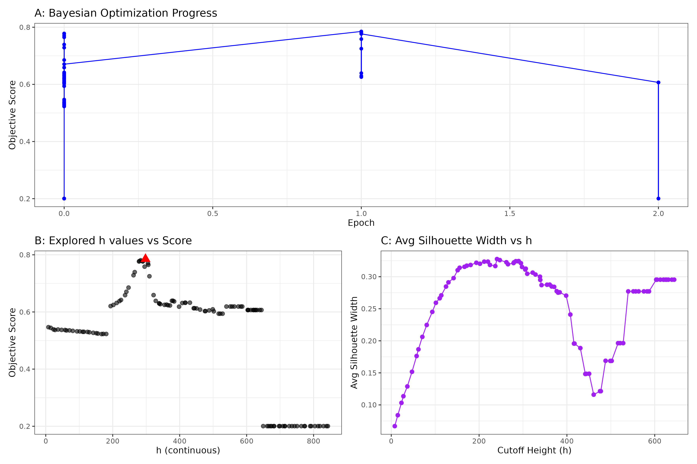
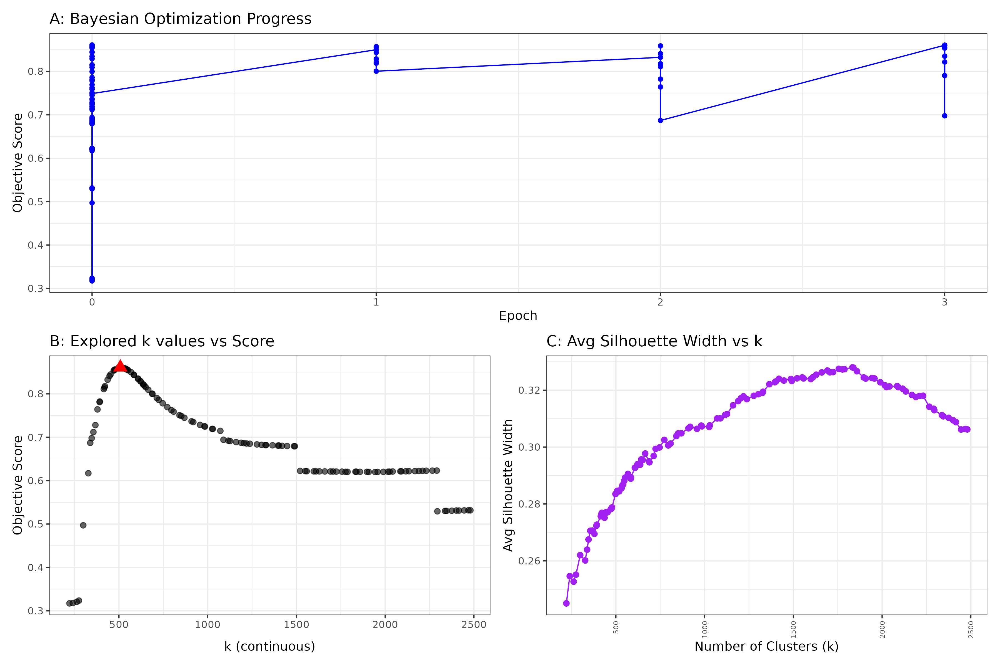
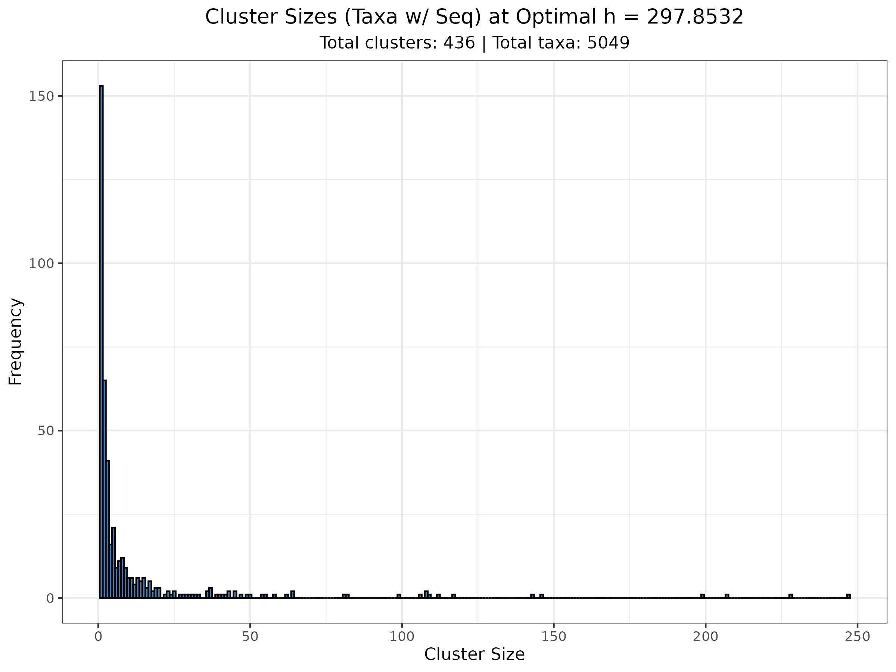
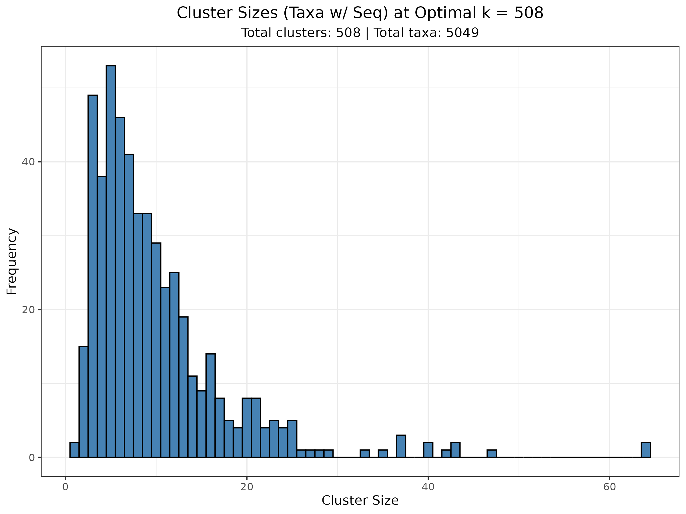

# BayesDistPrune

## Step 1: First you need to have a distance matrix of the target tree


```
Rscript distance_matrix.R <input_tree_file>


Arguments:
input_tree_file : Path to the phylogenetic tree file (e.g., Newick, Nexus).

```

## Step 2: Next use the distance matrix, with the original tree and fasta sequence file in either the bayes2.r (cutree method) or the bayes_kmedioids.r (kmedioids method).

```
 Usage:
# Rscript bayes_kmedoids.r <dist_matrix_rds> <tree_file> <fasta_file> <output_prefix> \
#                          <k_min> <k_max> <init_pts> <n_iter> \
#                          <med_min> <med_max> <mean_target> <min_msa_size> \
#                          <w_median> <w_mean> <w_identity> <w_silhouette> [num_cores]
#
# Arguments:
#   dist_matrix_rds    : Path to the distance matrix object (.rds file) for PAM clustering.
#   tree_file          : Path to the phylogenetic tree file (e.g., .tre, .newick) for Silhouette evaluation.
#   fasta_file         : Path to the sequence file (.fasta, .fa) - AA sequences.
#   output_prefix      : Prefix for output files (e.g., "kmedoids_run").
#   k_min              : Minimum number of clusters (k) to search (integer >= 2).
#   k_max              : Maximum number of clusters (k) to search (integer).
#   init_pts           : Number of initial random points (k values) for BO (integer).
#   n_iter             : Number of Bayesian Optimization iterations (integer).
#   med_min            : Target minimum median cluster size (numeric).
#   med_max            : Target maximum median cluster size (numeric).
#   mean_target        : Target mean cluster size (numeric).
#   min_msa_size       : Minimum cluster size for MSA/identity calculation (integer).
#   w_median           : Weight for median size score (numeric).
#   w_mean             : Weight for mean size score (numeric).
#   w_identity         : Weight for sequence identity score (numeric).
#   w_silhouette       : Weight for patristic silhouette score (numeric).
#   num_cores          : [Optional] Number of CPU cores for parallel processing (integer).
#
# Example:
# Rscript bayes_kmedoids.r seq_dist_matrix.rds tree.tre sequences.fasta kmedoids_run \
#                          5 100 20 50 5 12 10 3 0.3 0.15 0.45 0.1 8
#
```

<!-- cutree method Bayesian inference with ~5k tips -->
<figure>
  
  <figcaption><strong>Figure&nbsp;1.</strong> cutree method Bayesian inference with ~5 k tips.</figcaption>
</figure>

<!-- k-medoids method Bayesian inference with ~5k tips -->
<figure>
  
  <figcaption><strong>Figure&nbsp;2.</strong> k-medoids method Bayesian inference with ~5 k tips.</figcaption>
</figure>

<!-- cutree method histogram -->
<figure>
  
  <figcaption><strong>Figure&nbsp;3.</strong> Histogram of cluster sizes for the best cutree configuration.</figcaption>
</figure>

<!-- k-medoids method histogram -->
<figure>
  
  <figcaption><strong>Figure&nbsp;4.</strong> Histogram of cluster sizes for the best k-medoids configuration.</figcaption>
</figure>


## Step 3: Use the optimize_gap_minimize.rf.r with the bayes output .csv file, the original distance matrix from distance_matrix.r and the original tree file.

```
 --- Bayesian Optimization to Minimize RF Distance via Gap Threshold ---
#
# Description:
# This script uses Bayesian Optimization to find the optimal gap threshold for
# sequence filtering. The objective is to minimize the Robinson-Foulds (RF)
# distance between a UPGMA tree built from the filtered subset (with singleton
# rescue) and a reference tree.
#
# Usage:
# Rscript optimize_gap_minimize_rf.r <bayes_output_csv> <original_dist_matrix_rds> \
#                                    <reference_tree_file> \
#                                    <gap_min> <gap_max> <gap_init_pts> <gap_n_iter> \
#                                    <output_prefix>
#
# Arguments:
#   bayes_output_csv         : Path to CSV from a previous run (e.g., bayes_kmedoids.r)
#                                containing original cluster assignments and sequence info.
#                                Needs columns: tip_label, cluster, specimen_id, sequence.
#   original_dist_matrix_rds : Path to the original distance matrix RDS file.
#   reference_tree_file      : Path to the reference tree file (Newick).
#   gap_min                  : Minimum gap threshold (%) to search (0-100).
#   gap_max                  : Maximum gap threshold (%) to search (0-100).
#   gap_init_pts             : Number of initial random points (gap values) for BO.
#   gap_n_iter               : Number of Bayesian Optimization iterations for gap.
#   output_prefix            : Prefix for output files (e.g., "optimized_gap_minRF").
#
# Output Files:
#   <output_prefix>_bayesopt_results.rds : BO results object.
#   <output_prefix>_bayesopt_summary.csv : BO summary table (Score = 1/(1+RF)).
#   <output_prefix>_bayesopt_plots.png   : BO diagnostic plots.
#   <output_prefix>_best_dist_matrix.rds : Subsetted distance matrix for the best gap threshold.
#   <output_prefix>_best_info.csv        : Info CSV for the best subset.
#   <output_prefix>_best_hclust.tre      : Hclust tree for the best subset.
#   <output_prefix>_log.txt              : Log file detailing the process.
#
# Example:
# Rscript optimize_gap_minimize_rf.r kmedoids_run_clusters.csv dist_obj.rds ref.tre \
#                                    10 90 10 30 \
#                                    optimized_gap_minRF
```


<!-- Full vs. optimized hclust comparison -->
<figure>
  
  <figcaption><strong>Figure&nbsp;5.</strong> Comparison of the full tree (≈5 k tips) with the optimized hclust subset (≈500 tips), coloured by superfamily.</figcaption>
</figure>

```
--- Final Best Result Summary ---
Optimal Gap Threshold: 39.66 %
Best Minimum Normalized RF Distance achieved: 0.04332756
Number of Sequences Kept at Best Threshold: 580
Final Patristic Correlation: 1

```
